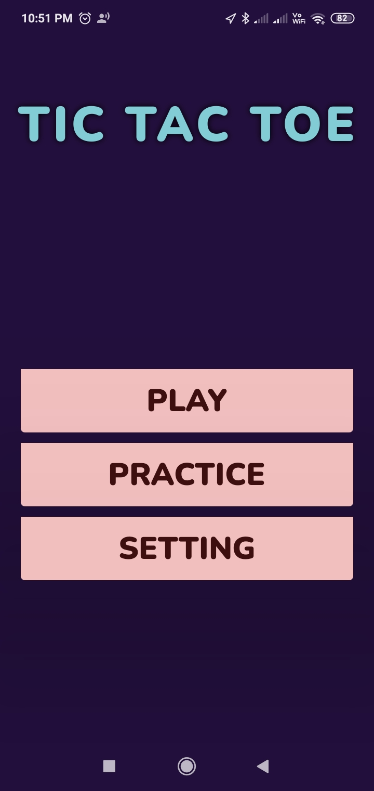
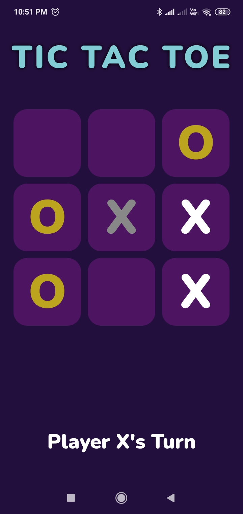
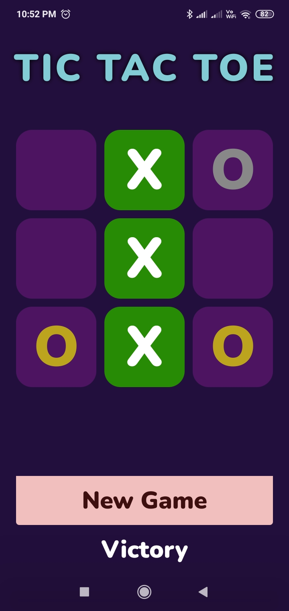
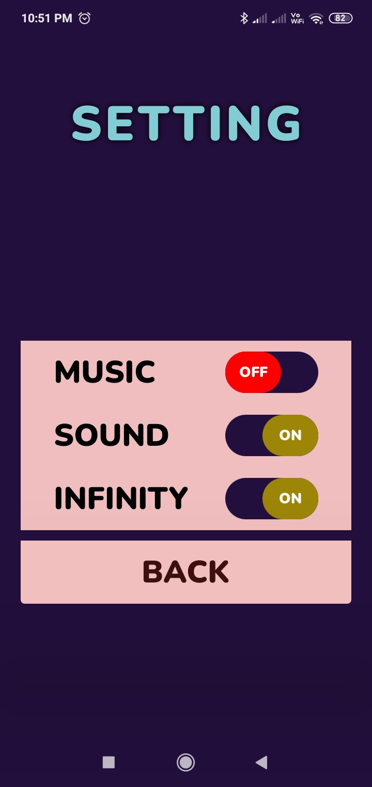

# Tic Tac Toe Game Built Using Jetpack Compose

Welcome to the Tic Tac Toe Game built using Jetpack Compose! This game offers both practice mode and multiplayer mode, with a twist in the default gameplay mode.

## Features

- **Practice Mode:** Play against an AI to sharpen your skills.
- **Multiplayer Mode:** Challenge your friends in a two-player game.
- **Classic Mode:** Enable the traditional version of Tic Tac Toe from the settings.
- **Infinite Mode (Default):** A unique twist on the classic game.

## Infinite Mode
In the **Infinite Mode**, each player can only use 3 pieces (like 3 'X's or 'O's) at a time. Once a player places their 4th piece, the first piece they placed will be removed from the board. This adds a layer of strategy and makes the game more interesting.

## Screenshot

## How to Enable Classic Mode
1. Navigate to the settings.
2. Disable the **Infinite Mode** toggle.
3. The game will revert to the standard Tic Tac Toe rules.

